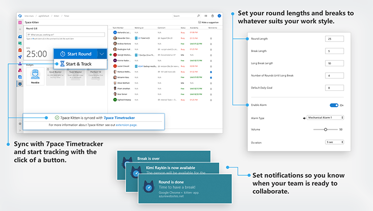

7pace Kitten is a handy tool for time management that helps you and your team increase productivity. Inspired by the Pomodoro Technique®, 7pace Kitten keeps you focused on work by setting a kitchen timer for 25 minutes, and organizes your day into rounds and breaks. Your colleagues can see who is focusing on what and receive notification on breaks for urgent hands-on. 7pace Kitten is even gamified to keep you motivated for rounds and rounds!

With seamless integration into 7pace Timetracker, you simply set the timer, concentrate solely on the task at hand for the specified stretch of time, and then enjoy a restorative break when the interval has ended!  The 7pace Kitten helps keep the team focused, on task, builds more efficient work habits, and helps eliminate procrastination.

Features of the 7pace Kitten include:
* Direct notification when your round or break is finished
* Direct notification when your team members are on a “break”
* Full support of browser notifications even if the tab is closed
* Configurable length of rounds and breaks
* Customizable sound
* **Integration with 7pace Timetracker**
* **Team status overview**
* **Fun “Badges” as you reach milestones within the timer** 
* **Free for you and your team!**
##Application Overview

 
“Pomodoro Technique®” and “Pomodoro®” are registered trademarks of Cirillo Consulting GmbH.
 
